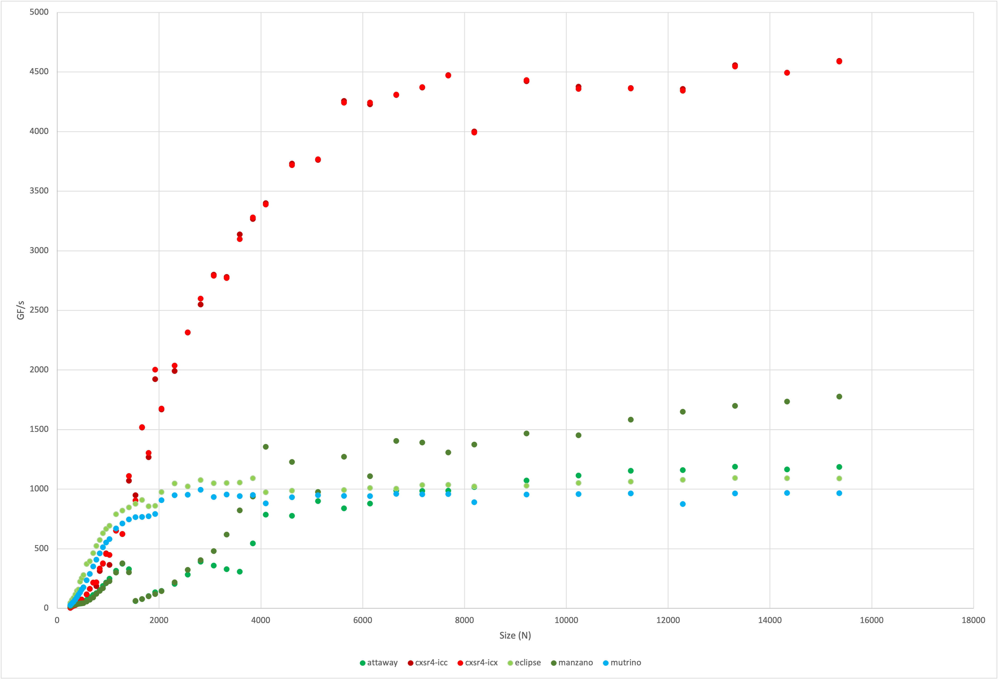

# Crossroads Acceptance

- PI: Douglas M. Pase [dmpase@sandia.gov](mailto:dmpase@sandia.gov)
- Erik A. Illescas [eailles@sandia.gov](mailto:eailles@sandia.gov)
- Anthony M. Agelastos [amagela@sandia.gov](mailto:amagela@sandia.gov)

This project tracks data and analysis from the Crossroads Acceptance effort.

## DGEMM
DGEMM is a routine from the Basic Linear Algebra Subroutine Level 3 (BLAS3)
library.
It performs two-dimensional matrix-matrix multiplication.
Matrix-matrix multiplication requires O(N**3) operations on two NxN matrices.
The operation is efficiently implemented using multiple layers of cache to
minimize data movement from memory to registers.
As a result, the bottleneck in this microbenchmark is the speed with which
the processor can execute floating-point vector addition and multiplication
instructions.
Architectures that have an efficient Floating-point Multiply-Add (FMA)
instruction are often able to obtain faster results than those without,
and tests should take care to enable it when possible.

DGEMM is often included as part of special libraries that are highly tuned
for specific architectures, such as Intel's Math Kernel Library (MKL) or
IBM's Parallel Engineering and Scientific Subroutine Library (PESSL).
It is also found in libraries designed to run efficiently on a wider range 
of architectures, such as ATLAS.

DGEMM is an effective measure of the *fastest* rate a program can do
floating-point vector arithmetic.
This is an important component of system performance, especially for codes 
that rely upon implicit methods to find solutions or otherwise use large,
dense (non-sparse) systems of equations.
DGEMM is a major component of dense linear equation solvers found in LINPACK
and LAPACK libraries.

Interestingly, the floating-point vector unit (FPU), when it is active, is 
without a doubt the most power-consuming component within a processor.
No other processor component consumes as much energy.
As a result, any weakness in the system cooling will often be exposed by 
this test.
DGEMM pushes the floating-point vector unit very hard, which heats up the
processor, causing the cooling system to ramp up.
If the cooling system is not able to take heat away from the processor as
quickly as the processor is able to produce it, the processor will throttle 
back its clock frequency in order to prevent overheating.
On the other hand, a strong cooling system will take away any excess heat
produced, allowing the FPU to increase its clock frequency up to the 
limits of frequency and power that the processor can handle.

DGEMM is also highly parallelizable, and many libraries make use of OpenMP
or similar thread libraries to enhance its performance.
Unlike STREAM, though, the placement of threads within a Non-Uniform Memory
Architecture (NUMA) system is not that critical.
Data is generally pre-fetched into local cache outside of the critical path,
and used from there.
Memory latency, whether local or remote, is hidden by overlapping data
movement with arithmetic operations.

On the other hand, some architectures with more than one virtual core per
physical core may (or may not) benefit from scheduling more threads than
there are physical cores in the processor.
Whether a particular architecture benefits will depend on its allocation of
FPUs to physical cores, as well as its ability to efficiently schedule them.
It is often best to test the performance using one (OpenMP) thread per
physical core as well as up to one thread per virtual core, to see where the
system obtains its best performance.

And finally, we were careful to try different sizes of matrices, to ensure we
reported the best performance possible.

| Cluster | Family          | Processor     | Frequency | Cores/Node | FPU     | DGEMM (GF/s) | Size  | MKL        |
| :-----: | :----:          | :-------:     | :-------: | :--------: | :-:     | -----------: | ---:  | :---:      |
| Mutrino | Haswell         | <A HREF="https://ark.intel.com/content/www/us/en/ark/products/81060/intel-xeon-processor-e52698-v3-40m-cache-2-30-ghz.html">E5-2698 v3</A>    | 2.30GHz   |         32 | AVX2    |  994.724111  |  2816 | 19.1.3     |
| Eclipse | Broadwell       | <A HREF="https://ark.intel.com/content/www/us/en/ark/products/91316/intel-xeon-processor-e52695-v4-45m-cache-2-10-ghz.html">E5-2695 v4</A>| 2.10GHz   |         36 | AVX2    | 1092.561058  | 13312 | 20.0.2.254 |
| Attaway | Skylake         | <A HREF="https://ark.intel.com/content/www/us/en/ark/products/120485/intel-xeon-gold-6140-processor-24-75m-cache-2-30-ghz.html">Gold 6140</A> | 2.30GHz   |         36 | AVX-512 | 1187.517000  | 13312 | 15.0       |
| Manzano | Cascade Lake    | <A HREF="https://ark.intel.com/content/www/us/en/ark/products/192481/intel-xeon-platinum-8268-processor-35-75m-cache-2-90-ghz.html">Platinum 8268</A> | 2.90GHz   |         48 | AVX-512 | 1777.013911  | 15360 | 15.0       |
| cxsr    | Sapphire Rapids | Sample        |           |         56 | AVX-512 | 4593.901569  | 15360 | 2022.0.2   |

***DGEMM Best Results for Various Sandia Systems***

***DGEMM Results for Various Sandia Systems***

